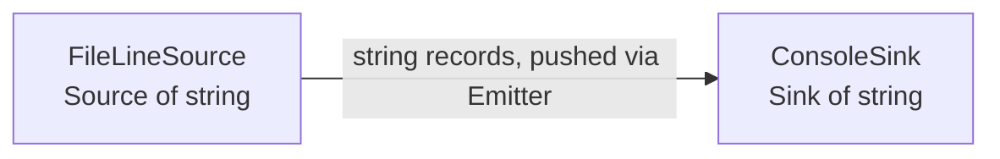

# LogFlow — Architecture

*Sections 1-8 describe Increment 1 (the skeleton). Increment 2 is documented in section 9 at the end; where the two disagree (record type, `ConsoleSink`), section 9 wins.*

## Increment 1: The Skeleton Pipeline

## 1. The two-box diagram

At the end of week one the system is exactly two components joined by one connector.

```
   +--------------------+      Emitter<string>       +--------------------+
   |   FileLineSource   | -------------------------> |    ConsoleSink     |
   |  (a Source<string>)|   one record per line,     |  (a Sink<string>)  |
   |                    |   pushed, in order         |                    |
   +--------------------+                            +--------------------+
             ^                      ^                          ^
             |                      |                          |
             +---------- assembled and driven by Pipeline -----+
                        (Main only wires it up and calls run())
```



The **boxes** are components; the **arrow** is a connector. The pipeline's
value is not visible yet. Reading a file and printing it is deliberately
trivial, because week one is about getting the *shape* right.

## 2. Vocabulary

| Term | Meaning | Contract (header) |
|---|---|---|
| **Record** | One unit of data flowing through the system (a `std::string` this week) | – |
| **Source** | Where records come from; pushes them into an `Emitter` | `Source.hpp` |
| **Stage** | A step that turns each input into zero, one, or many outputs | `Stage.hpp` |
| **Sink** | Where records end up | `Sink.hpp` |
| **Emitter** | The place a component hands its output to | `Emitter.hpp` |
| **Pipeline** | The connector: an ordered chain source → stages → sink with a `run()` | `Pipeline.hpp` |

The five contracts delivered this week are `Stage`, `Emitter`, `Source`,
`Sink` and `StageException`.

## 3. Interface vs. implementation

| Interface (the contract) | Implementation (one way to honour it) |
|---|---|
| `Source<std::string>` | `FileLineSource` |
| `Sink<std::string>` | `ConsoleSink` |
| `Stage<I, O>` | none this week (tests contain several) |

The interfaces are small on purpose (one core method each). Everything that
changes from week to week (parsers, filters, aggregators, other sources and
sinks) is a new *implementation*; the interfaces and the `Pipeline` do not
change.

**Dependency rule:** `Pipeline.hpp` includes only the four interface headers.
It has never heard of `FileLineSource` or `ConsoleSink`. Only `Main.cpp`
knows the concrete classes, and it only uses them to choose what to plug in.

```
   Main.cpp ──uses──> FileLineSource ──implements──> Source<T> <──uses── Pipeline
       │                                                                    ^
       ├────────────uses──> ConsoleSink ──implements──> Sink<T>  <──uses────┤
       └────────────────────────────────── builds and calls run() ──────────┘
```

## 4. Design note: why `process` emits instead of returning

`Stage::process(input, out)` pushes results into an `Emitter` rather than
returning a value. A return value forces a **1 : 1** relationship between
inputs and outputs. Real stages are not like that:

- a **filter** produces *zero* outputs for records it rejects,
- a **map** produces *one*,
- a **splitter** (for example one line into several fields) produces *many*.

With an `Emitter`, all three have the same signature, so the pipeline treats
every stage uniformly. The tests demonstrate this with `DropEmptyStage`
(0 or 1 out) and `SplitWordsStage` (0..n out).

A second benefit: records flow **one at a time** through the whole chain
(source → stage → stage → sink), so nothing is buffered between steps. The test
`records_are_streamed_one_at_a_time_not_buffered_between_steps` pins that down;
a 10 GB log would use the same memory as a 200-line one.

## 5. Lifecycle

`Stage` has `open()` and `close()` hooks, unused this week. The pipeline
already honours them, so later increments can rely on it:

1. `open()` on every stage, in order.
2. Records flow.
3. `close()` on every stage, in **reverse** order, *even if something threw*.

If `open()` fails on stage *k*, only stages *0..k-1* (the ones actually opened)
are closed. If the run failed, the original exception is the one the caller
sees. All of this is covered by tests.

## 6. C++-specific decisions

- **Templates instead of generics.** `Stage<I, O>` is a class template, so
  type errors are caught at compile time. `from(source).then(stage).to(sink)`
  is a typed builder: if a stage's input type does not match the previous
  step's output type, the code does not compile.
- **`std::shared_ptr` ownership.** The pipeline shares ownership of its
  components, so callers cannot end up with dangling references.
- **`Emitter::emit(T item)` takes its argument by value**, so a source can move
  a line into the pipeline without copying.
- **Exceptions:** `StageException` for stage failures; `std::runtime_error`
  for I/O problems in `FileLineSource`/`ConsoleSink`. `Main` turns any
  exception into a message on `stderr` and exit code `1` (`2` for bad usage).

## 7. Known limitations (intentional for week one)

- Synchronous and single-threaded: `run()` blocks until the source is exhausted.
- No back-pressure or batching. The push model has none.
- The only record type in use is `std::string`.
- The pipeline is a straight line; no branching or fan-out.

## 8. Testing

`make test` runs 22 unit tests with a small built-in harness (no external
framework). They cover both concrete components, every pipeline behaviour
described above, and an end-to-end check that the sample log comes out
byte-for-byte identical. `make check` does the same through the real
executable using `diff`.

---

## 9. Increment 2: typed records and the first real stage

```
 FileLineSource ──string──> ParserStage ──LogRecord──> ConsoleSink
 (Source<string>)       (Stage<string,LogRecord>)      (Sink<LogRecord>)
```

Three boxes now, two connectors. The pipeline no longer carries strings from
end to end: it carries a **domain model**.

### Separation of concerns

| Concern | Owner |
|---|---|
| Getting lines (files, I/O errors, line endings) | `FileLineSource` |
| Knowing what a log line *means* | `ParserStage` |
| What a record *is* | `LogRecord` |
| How a record *looks on screen* | `ConsoleSink` |
| Wiring and ordering | `Pipeline` / `Main` |

The parser has no idea where lines come from (the tests feed it plain strings)
and no idea what happens to records afterwards. The sink has no idea records
were ever text.

### `LogRecord`: immutable and extensible

- **Immutable:** all members are `const`, set in the constructor. A stage that
  wants a different record builds a new one, so no downstream stage can be
  surprised by an upstream edit. (Side effect: records are copy-constructible
  but not assignable, which is fine for a record that only flows forward.)
- **`attributes` (`std::map<string,string>`) is the extension point.** The
  parser fills in what it knows. Later increments (5-7) will add facts it cannot
  know (a geo-IP country, a session id, a tag set by a rule) by emitting a new
  record with extra attributes, with **no change** to `LogRecord`, `ParserStage`,
  `Pipeline` or any existing stage. A closed record type would instead force an
  edit to every class that touches it each time a new fact appears. The parser
  leaves it empty for now.
- **`raw`** keeps the original line, so nothing the parser ignores (for example
  the referer) is lost.
- **`path`** is the request target exactly as logged, query string included.
  Splitting or normalising it is a later stage's job; the parser stays faithful
  to the input.
- **`timestamp`** is a `std::chrono::system_clock::time_point` in UTC; the log's
  time-zone offset is applied while parsing. Date arithmetic lives in
  `TimeUtil.hpp` (no `std::get_time`/`timegm`, which differ between macOS and
  Linux).

### `ParserStage`

- Accepts Common Log Format and the "combined" extension (referer + user agent)
  that the sample log uses. Plain CLF is accepted too (`userAgent` is `""`).
- Hand-written field scanner instead of `std::regex`: handles quoted fields with
  spaces and `\"` escapes, tolerates runs of spaces between fields, and is
  faster and easier to debug than a regex.
- **Malformed lines are only skipped and counted** (blank line, missing field,
  bad timestamp, bad status code, unterminated quote, trailing junk). They emit
  nothing; `malformedCount()` reports them and `Main` prints the total at the
  end. *Handling them properly (reporting which line and why, a dead-letter
  output, a policy) is Increment 5.* The architecture is being built layer by
  layer on purpose: this week's stage does the minimum so that week 5 has
  something concrete to improve.

### Adding the stage touched almost nothing

`Pipeline.hpp`, `Pipeline.cpp`, `Source.hpp`, `Stage.hpp`, `Emitter.hpp`,
`Sink.hpp`, `StageException.hpp` and `FileLineSource` are **unchanged**. The only
existing production files edited are `Main.cpp` (one `.then(parser)` line plus
printing the count) and `ConsoleSink` (it now consumes `LogRecord`, which is task 3,
not a consequence of adding the parser). This is the open/closed principle from
section 3 paying off: a new stage is a new class plus one line of wiring.

### Testing without the file system

`tests/test_support.hpp` now has `CollectingEmitter<T>`, a **test double**: an
`Emitter` that just stores whatever it is given. A stage test is therefore:

```
ParserStage stage;
CollectingEmitter<LogRecord> out;
stage.process("<one log line>", out);
// look at out.items and stage.malformedCount()
```

This works because `Stage::process` takes its input as an argument and sends its
output to an interface (`Emitter`) instead of reading a file or writing to the
console. Nothing in the stage is hard-wired to I/O, so the test needs no
`Source`, no `Sink`, no `Pipeline` and no disk, which makes it fast, deterministic
and independent of the other components. It will be reused by every later stage.

### Known limitations

- Malformed lines are counted only (until Increment 5).
- Only the first 15 digits of the bytes field are accepted; status must be 100-599.
- The referer is parsed but not stored (it is still in `raw`).
- IPv6 and hostnames are accepted as opaque text; the IP is not validated.
- Tests: 40 (the 22 from Increment 1, with the console and end-to-end ones reworked for records, plus 18 new). See the README for coverage.
