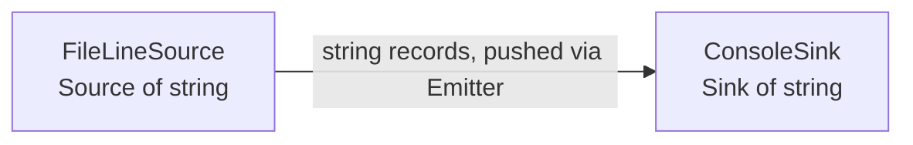

# LogFlow — Architecture (Increment 1: The Skeleton Pipeline)

## 1. The two-box diagram

At the end of week one the system is exactly two components joined by one connector.

```
   +--------------------+      Emitter<string>       +--------------------+
   |   FileLineSource   | -------------------------> |    ConsoleSink     |
   |  (a Source<string>)|   one record per line,     |  (a Sink<string>)  |
   |                    |   pushed, in order         |                    |
   +--------------------+                            +--------------------+
             ^                      ^                          ^
             |                      |                          |
             +---------- assembled and driven by Pipeline -----+
                        (Main only wires it up and calls run())
```



The **boxes** are components; the **arrow** is a connector. The pipeline's
value is not visible yet. Reading a file and printing it is deliberately
trivial, because week one is about getting the *shape* right.

## 2. Vocabulary

| Term | Meaning | Contract (header) |
|---|---|---|
| **Record** | One unit of data flowing through the system (a `std::string` this week) | – |
| **Source** | Where records come from; pushes them into an `Emitter` | `Source.hpp` |
| **Stage** | A step that turns each input into zero, one, or many outputs | `Stage.hpp` |
| **Sink** | Where records end up | `Sink.hpp` |
| **Emitter** | The place a component hands its output to | `Emitter.hpp` |
| **Pipeline** | The connector: an ordered chain source → stages → sink with a `run()` | `Pipeline.hpp` |

The five contracts delivered this week are `Stage`, `Emitter`, `Source`,
`Sink` and `StageException`.

## 3. Interface vs. implementation

| Interface (the contract) | Implementation (one way to honour it) |
|---|---|
| `Source<std::string>` | `FileLineSource` |
| `Sink<std::string>` | `ConsoleSink` |
| `Stage<I, O>` | none this week (tests contain several) |

The interfaces are small on purpose (one core method each). Everything that
changes from week to week (parsers, filters, aggregators, other sources and
sinks) is a new *implementation*; the interfaces and the `Pipeline` do not
change.

**Dependency rule:** `Pipeline.hpp` includes only the four interface headers.
It has never heard of `FileLineSource` or `ConsoleSink`. Only `Main.cpp`
knows the concrete classes, and it only uses them to choose what to plug in.

```
   Main.cpp ──uses──> FileLineSource ──implements──> Source<T> <──uses── Pipeline
       │                                                                    ^
       ├────────────uses──> ConsoleSink ──implements──> Sink<T>  <──uses────┤
       └────────────────────────────────── builds and calls run() ──────────┘
```

## 4. Design note: why `process` emits instead of returning

`Stage::process(input, out)` pushes results into an `Emitter` rather than
returning a value. A return value forces a **1 : 1** relationship between
inputs and outputs. Real stages are not like that:

- a **filter** produces *zero* outputs for records it rejects,
- a **map** produces *one*,
- a **splitter** (for example one line into several fields) produces *many*.

With an `Emitter`, all three have the same signature, so the pipeline treats
every stage uniformly. The tests demonstrate this with `DropEmptyStage`
(0 or 1 out) and `SplitWordsStage` (0..n out).

A second benefit: records flow **one at a time** through the whole chain
(source → stage → stage → sink), so nothing is buffered between steps. The test
`records_are_streamed_one_at_a_time_not_buffered_between_steps` pins that down;
a 10 GB log would use the same memory as a 200-line one.

## 5. Lifecycle

`Stage` has `open()` and `close()` hooks, unused this week. The pipeline
already honours them, so later increments can rely on it:

1. `open()` on every stage, in order.
2. Records flow.
3. `close()` on every stage, in **reverse** order, *even if something threw*.

If `open()` fails on stage *k*, only stages *0..k-1* (the ones actually opened)
are closed. If the run failed, the original exception is the one the caller
sees. All of this is covered by tests.

## 6. C++-specific decisions

- **Templates instead of generics.** `Stage<I, O>` is a class template, so
  type errors are caught at compile time. `from(source).then(stage).to(sink)`
  is a typed builder: if a stage's input type does not match the previous
  step's output type, the code does not compile.
- **`std::shared_ptr` ownership.** The pipeline shares ownership of its
  components, so callers cannot end up with dangling references.
- **`Emitter::emit(T item)` takes its argument by value**, so a source can move
  a line into the pipeline without copying.
- **Exceptions:** `StageException` for stage failures; `std::runtime_error`
  for I/O problems in `FileLineSource`/`ConsoleSink`. `Main` turns any
  exception into a message on `stderr` and exit code `1` (`2` for bad usage).

## 7. Known limitations (intentional for week one)

- Synchronous and single-threaded: `run()` blocks until the source is exhausted.
- No back-pressure or batching. The push model has none.
- The only record type in use is `std::string`.
- The pipeline is a straight line; no branching or fan-out.

## 8. Testing

`make test` runs 22 unit tests with a small built-in harness (no external
framework). They cover both concrete components, every pipeline behaviour
described above, and an end-to-end check that the sample log comes out
byte-for-byte identical. `make check` does the same through the real
executable using `diff`.
